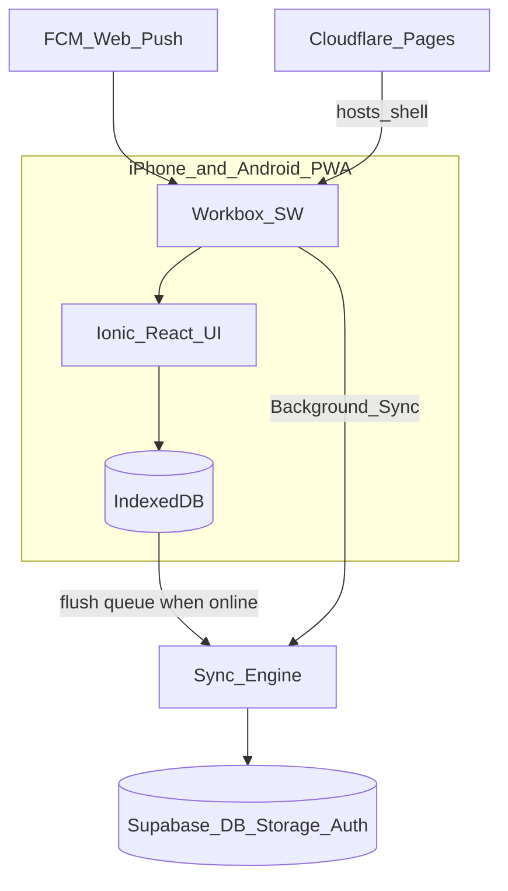
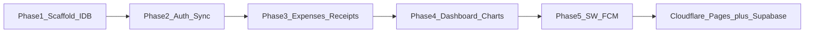

# MyExpense — Full Plan (Phases 1–5)

## Product and stack (locked)

- **App:** Personal offline-first expense tracker PWA (Android + iOS)
- **Frontend:** React (Vite) + TypeScript + Ionic React (adaptive iOS/MD)
- **Offline:** IndexedDB via `idb`; write-first mutations; sync queue outbox
- **PWA:** `vite-plugin-pwa` + Workbox (shell cache; Background Sync in Phase 5)
- **Backend:** Supabase (Auth email/password, Postgres, Storage for receipts)
- **Charts:** Recharts
- **Push:** Firebase Cloud Messaging (Web Push)
- **Hosting (later deploy):** Cloudflare Pages + env vars; Supabase cloud free tier
- **Router:** `react-router-dom@5` + `@ionic/react-router`
- **Default currency:** `USD` (editable in Settings)

## End-state architecture

## Sync rules (all phases after Phase 1)

1. **Write first** — mutations hit IndexedDB immediately; UI updates from local data.
2. **Enqueue** — each mutation adds a `sync_queue` item.
3. **Flush when online** — sync engine pushes to Supabase; marks rows `synced`.
4. **Hydrate on launch** — if IndexedDB is empty and session exists, pull remote → fill IDB.
5. **Conflicts** — last-write-wins via `updated_at`.

## Supabase schema (created in Phase 2)

- `profiles` — `id` (FK auth.users), `monthly_budget`, `currency`, `updated_at`
- `expenses` — `id`, `user_id`, `amount`, `category`, `description`, `date`, `receipt_url`, `created_at`, `updated_at`
- Storage bucket `receipts` — path `{user_id}/{expense_id}.jpg`
- RLS — users read/write only their own rows
- SQL migration file checked into repo: `supabase/migrations/001_init.sql`

---

# Phase 1 — Project scaffolding and offline database

## Goal

Runnable adaptive Ionic app with 3 tabs, installable PWA shell, and working local CRUD for expenses/profile. No live Supabase/FCM.

## Deliverables

- Vite + React + TS + Ionic + `vite-plugin-pwa` project in repo root
- `src/theme/variables.css`, `setupIonicReact()`, tabs: Dashboard / Expenses / Settings
- IndexedDB DB `myexpense` v1 stores: `expenses`, `profile`, `sync_queue`, `receipt_blobs`
- Repos + hooks; Settings smoke UI (set budget, add sample expense, show queue count)
- Stubs: `services/offline/hydration.ts`, `services/sync/sync-engine.ts`
- `.env.example` with Supabase/FCM placeholders

## Key files

- `[vite.config.ts](vite.config.ts)`, `[src/main.tsx](src/main.tsx)`, `[src/App.tsx](src/App.tsx)`
- `[src/pages/tabs/TabsLayout.tsx](src/pages/tabs/TabsLayout.tsx)`
- `[src/db/schema.ts](src/db/schema.ts)`, `[src/db/expenses.repo.ts](src/db/expenses.repo.ts)`, `[src/db/profile.repo.ts](src/db/profile.repo.ts)`, `[src/db/sync-queue.repo.ts](src/db/sync-queue.repo.ts)`
- `[src/hooks/useExpenses.ts](src/hooks/useExpenses.ts)`, `[src/hooks/useProfile.ts](src/hooks/useProfile.ts)`

## Acceptance

- Tabs work; iOS vs Android look adaptive
- Sample expense survives refresh
- `npm run build` emits service worker + manifest

---

# Phase 2 — Authentication and Supabase core integration

## Goal

Email/password auth; map local guest data to real `user_id`; bidirectional sync between IndexedDB and Supabase; hydration on empty local DB.

## Deliverables

- Supabase project setup docs in README; `supabase/migrations/001_init.sql` (tables, RLS, storage policies)
- `[src/lib/supabase/client.ts](src/lib/supabase/client.ts)` — anon client from `VITE_SUPABASE_*`
- Auth pages: Login / Register using adaptive `IonCard` + `IonInput`
- Auth gate in `App.tsx`: unauthenticated → auth routes; authenticated → tabs
- On first login: create `profiles` row; re-key local expenses to `auth.user.id` if migrating from guest
- Implement `sync-engine.ts`:
  - flush `sync_queue` (create/update/delete expenses, upsert profile)
  - pull remote changes newer than last sync watermark (store watermark in IDB or profile meta)
- Implement `hydration.ts`: if expenses store empty + session → fetch all expenses + profile → IDB
- Settings: sign out, show sync status / last sync time / pending count, manual “Sync now”
- Online/offline listener triggers flush

## Key files

- `[src/pages/auth/LoginPage.tsx](src/pages/auth/LoginPage.tsx)`, `[src/pages/auth/RegisterPage.tsx](src/pages/auth/RegisterPage.tsx)`
- `[src/lib/supabase/auth.ts](src/lib/supabase/auth.ts)`
- `[src/services/sync/sync-engine.ts](src/services/sync/sync-engine.ts)`
- `[src/services/offline/hydration.ts](src/services/offline/hydration.ts)`
- `[supabase/migrations/001_init.sql](supabase/migrations/001_init.sql)`

## Acceptance

- Register/login on both phones with same account shows same data after sync
- Offline edit → comes online → row appears in Supabase
- Wipe site data → relaunch logged in → hydration restores expenses

---

# Phase 3 — Expense logging system

## Goal

Full daily expense capture UX with categories, date picker, optional compressed receipt, swipe/delete list.

## Deliverables

- Expenses tab: chronological list grouped by day; amounts formatted via `money.ts`
- FAB opens adaptive `IonModal` expense form
- Fields: amount (numeric inputMode), category select (`Food`, `Travel`, `Rent`, `Utilities`, `Entertainment`, `Other`), `IonDatetime` date, description
- Validation: amount > 0, category + date required
- Save → IndexedDB upsert + sync queue enqueue (Phase 2 engine flushes)
- Delete: `IonItemSliding` swipe-to-delete (iOS bounce / MD reveal via Ionic defaults)
- Receipts:
  - file input / capture `accept="image/*" capture="environment"`
  - compress client-side (canvas → JPEG, max edge ~1280px, quality ~0.7)
  - store Blob in `receipt_blobs`; set `local_receipt_blob_key` on expense
  - sync step uploads to Supabase Storage `receipts`, sets `receipt_url`, clears local blob when synced
- Thumbnail on list item when receipt present; tap to preview (`IonModal` image)

## Key files

- `[src/components/expenses/ExpenseFormModal.tsx](src/components/expenses/ExpenseFormModal.tsx)`
- `[src/components/expenses/ExpenseList.tsx](src/components/expenses/ExpenseList.tsx)`
- `[src/services/storage/receipts.ts](src/services/storage/receipts.ts)`
- `[src/pages/ExpensesPage.tsx](src/pages/ExpensesPage.tsx)`

## Acceptance

- Add/edit/delete expenses works offline and syncs online
- Receipt attach works without network; uploads after reconnect
- List gestures feel native on iOS and Android

---

# Phase 4 — Dashboard, budget analytics, and charts

## Goal

Current-month budget tracking + historical month comparison with overspending highlight.

## Deliverables

- Dashboard tab:
  - Planned budget (from profile; inline edit or link to Settings)
  - Spent so far (sum of expenses in current calendar month)
  - Remaining = budget − spent (clamp display when overspent)
  - Progress bar / meter (Ionic `IonProgressBar` or custom)
  - **Burn-rate indicator:** compare actual daily spend rate vs allowed rate (`budget / daysInMonth`); warn if projected month-end spend > budget given days elapsed
- Settings: primary place to set `monthly_budget` and `currency`
- Analytics section (Dashboard or sub-view):
  - Recharts bar/line of total spend per month (last 6–12 months from local expenses)
  - Highlight max month with “Overspending Alert” badge/callout
- Empty states when no data
- All calculations from IndexedDB (works offline); no server aggregates required

## Key files

- `[src/pages/DashboardPage.tsx](src/pages/DashboardPage.tsx)`
- `[src/components/dashboard/BudgetMeter.tsx](src/components/dashboard/BudgetMeter.tsx)`
- `[src/components/dashboard/BurnRateIndicator.tsx](src/components/dashboard/BurnRateIndicator.tsx)`
- `[src/components/dashboard/MonthCompareChart.tsx](src/components/dashboard/MonthCompareChart.tsx)`
- `[src/core/utils/budget.ts](src/core/utils/budget.ts)` — spent, remaining, burn helpers

## Acceptance

- Budget numbers match expense sums for current month
- Burn-rate warning appears when spending too fast
- Chart compares months; highest month clearly flagged

---

# Phase 5 — PWA service worker hardening and FCM

## Goal

Reliable offline replay via Workbox Background Sync, platform-specific install guidance, and web push reminders via FCM.

## Deliverables

### Workbox / offline

- Extend `vite-plugin-pwa` Workbox config: runtime caching for Supabase REST GETs where safe; **Background Sync** queue for failed mutation requests (align with existing `sync_queue` — prefer one source of truth: flush `sync_queue` from app `online` event **and** SW tag `replay-sync` that calls same flush logic via `postMessage` / clients claim)
- Ensure app shell always loads offline after first visit

### Add to Home Screen

- Android Chrome: capture `beforeinstallprompt`; show native-looking bottom sheet CTA
- iOS Safari: detect standalone false + iOS; show instructional tooltip (Share → Add to Home Screen)
- Component: `[src/components/pwa/InstallPrompt.tsx](src/components/pwa/InstallPrompt.tsx)`

### FCM web push

- Firebase project web config in env: `VITE_FIREBASE_*`
- `[src/push/fcm.ts](src/push/fcm.ts)`: init messaging, request permission, get token
- Store FCM token in Supabase `profiles` column `fcm_token` (add migration `002_fcm_token.sql`)
- Service worker messaging handler for background notifications
- In-app Settings toggle: “Daily expense reminder”
- Sending side (minimal for personal use): document Cloudflare Worker or Firebase Console / scheduled function to send daily reminder; implement a small Cloudflare Worker cron stub under `workers/daily-reminder/` that reads tokens from Supabase service role and sends via FCM HTTP v1 — free-tier oriented

## Key files

- `[vite.config.ts](vite.config.ts)` (Workbox Background Sync section)
- `[src/components/pwa/InstallPrompt.tsx](src/components/pwa/InstallPrompt.tsx)`
- `[src/push/fcm.ts](src/push/fcm.ts)`
- `[supabase/migrations/002_fcm_token.sql](supabase/migrations/002_fcm_token.sql)`
- `[workers/daily-reminder/](workers/daily-reminder/)` (cron sender stub)

## Acceptance

- App usable offline; queued mutations replay after connectivity
- Android sees install sheet; iOS sees Share instructions
- Permission grant stores FCM token; test notification received on Android; iOS Home Screen PWA receives when OS supports web push

---

## Execution order and deploy checkpoint

Deploy to Cloudflare Pages after Phase 2 (earliest useful cross-phone sync) or after Phase 5 (full features). Supabase Auth Site URL / redirect allowlist must include the Pages HTTPS origin.

## What “done” means for the whole app

- Log expenses with optional receipt on either phone
- See month spend, budget left, burn-rate warning
- Compare months and spot the highest-spend month
- Data available on both devices via Supabase when online; usable offline via IndexedDB
- Installable PWA with reminder push path configured

